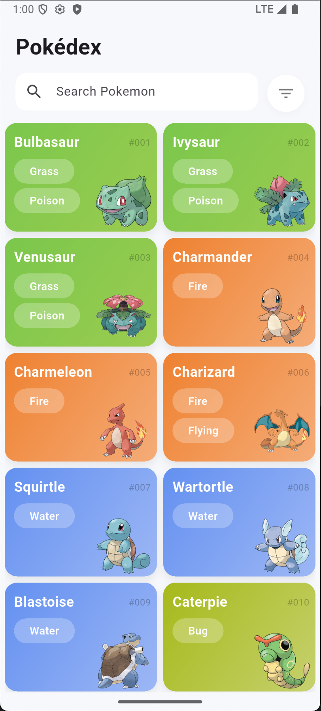
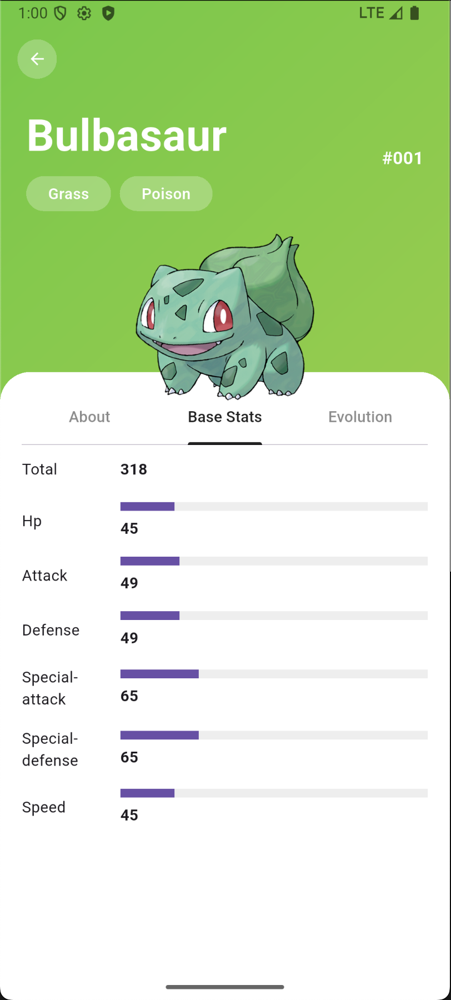
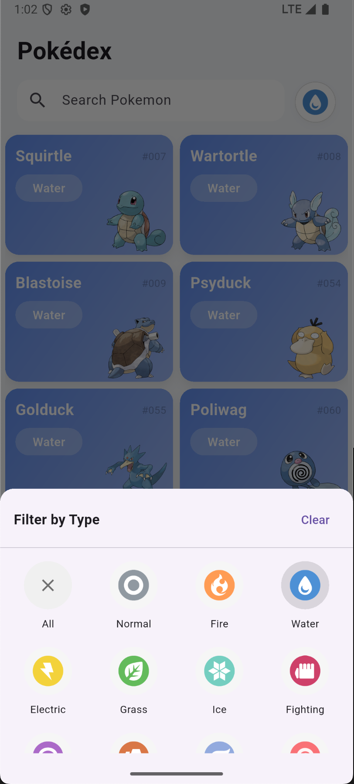

# Pokédex Flutter App

A **beautiful and performant Pokédex app** built with **Flutter**, designed to browse Pokémon data from the [PokéAPI](https://pokeapi.co/).  
The app supports **offline caching**, **searching**, **filtering**, and **infinite scrolling** for smooth performance and usability.

---
## **Features**

- 📱 **Cross-platform**: Runs on Android and iOS.
- ⚡ **Fast loading** with in-memory and persistent caching via [Hive](https://pub.dev/packages/hive).
- 🔍 **Search & filter** Pokémon by name and type.
- ♾️ **Infinite scroll** to browse through all Pokémon dynamically.
- 📡 **Automatic API fallback**: Fetches Pokémon not yet cached locally.
- 🐛 **Offline support**: View previously fetched Pokémon even without internet.
- 🎨 **Beautiful type icons and colors** for each Pokémon type.
- 🔄 **Detailed Pokémon pages**:
  - Evolution chain.
  - Base stats and descriptions.

---


## **Demo**

| Overview Screen | Pokémon Detail | Search & Filter |
|-----------------|----------------|-----------------|
|  |  |  |

---
## Tech Stack

| Technology | Purpose |
|------------|---------|
| **Flutter** | Cross-platform mobile development |
| **Hive** | Local persistent database for caching Pokémon |
| **Dio** | Networking and API requests |
| **PokéAPI** | Pokémon data source |


## Caching Strategy

The app uses **two-level** caching to reduce API calls and improve speed:

1. In-memory cache

- Stores Pokémon fetched during the current session.

- Fastest way to retrieve data.

2. Hive persistent cache

- Stores Pokémon locally on the device.

- Survives app restarts.

- Reduces redundant network calls.

- Great for offline browsing.

### Example Flow:

When a Pokémon is needed:

- Check in-memory cache.

- If not found → check Hive local database.

- If still not found → fetch from PokéAPI and save it to both caches.
## Run Locally

1. Clone the project

```bash
  git clone https://github.com/dkathrine/Flutter-PokeDex.git
```

2. Go to the project directory

```bash
  cd flutter-pokedex
```

3. Install dependencies

```bash
  flutter pub get
```

4. Start your emulator and:

```bash
  flutter run
```


## Usage

#### Search
- Search Pokémon by name

#### Filtering
- Filter Pokémon by type, e.g. "Fire", "Water", "Grass"...

#### Infinite Scroll
- Pokémon load dynamically as you scroll.
- Prevents overloading the API with unnecessary requests.

### Offline Support
Once Pokémon are loaded:
- They are saved locally in Hive.
- Even without internet, you can browse previously fetched Pokémon.
## Future Improvements
- Implement Pokémon Variations in Evolution Tab
- Implement Moves Tab to display when Pokémon learn moves
- (Might also add fetch on Search at some point)